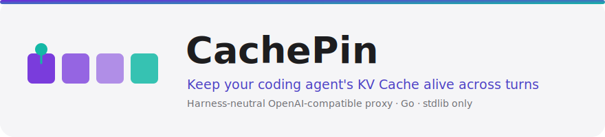
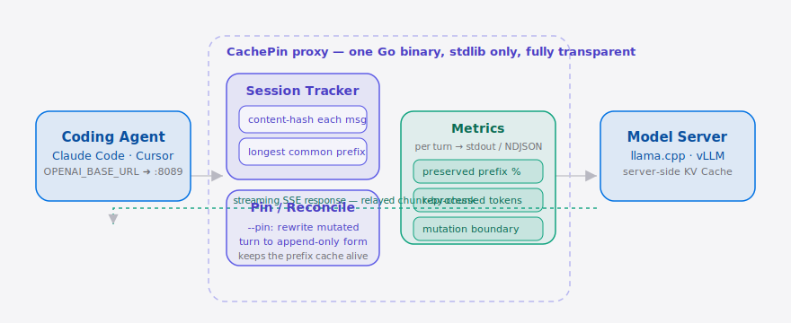
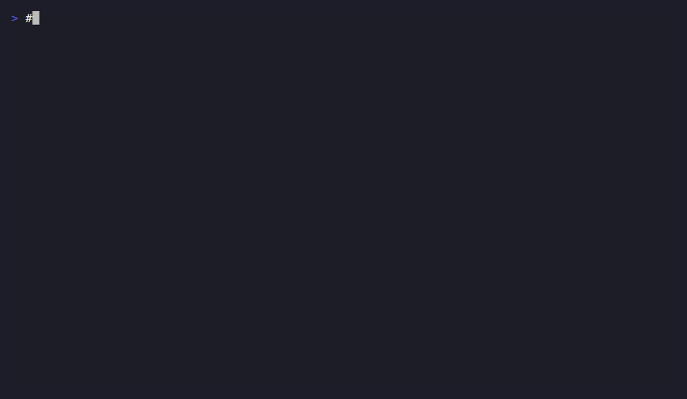

<p align="center">
  <picture>
    <source media="(prefers-color-scheme: dark)" srcset="./assets/hero-dark.svg">
    <source media="(prefers-color-scheme: light)" srcset="./assets/hero-light.svg">
    
  </picture>
</p>

<p align="center"><a href="./README.md">English</a> | <strong>简体中文</strong></p>

<p align="center">
  <a href="./LICENSE"></a>
  <a href="https://github.com/SuperMarioYL/cachepin/releases"></a>
  <a href="https://github.com/SuperMarioYL/cachepin/actions"></a>
  
  
  
</p>

> 一个单文件 Go 二进制，塞在你的 **Coding Agent** harness 和 OpenAI 兼容模型服务之间。它会量化——并在加上 `--pin` 后保护——那块被 harness 悄悄打掉的服务端 **KV Cache**。

## 为什么是现在

如果你自建模型（llama.cpp、vLLM），再用 Claude Code、Cursor、opencode 这类 **Coding Agent** harness 去驱动它，你大概率交过这笔「税」：harness 重渲染一个工具结果、或压缩一次上下文，消息数组在第 3 条变了，推理服务的 **KV Cache** 从那一条开始整段失效——于是每一轮都默默重算 3 万多个 token。[@CreativelyBankrupt](https://twitter.com/CreativelyBankrupt) 一直在提的正是这种前缀缓存的脆弱性；r/LocalLLaMA 的 "checkpoints" 帖子、以及 [Hmbown/CodeWhale](https://github.com/Hmbown/CodeWhale) 这类定制 agent，都是在一个个 harness 上各自打补丁。CachePin 把这个思路做成了可移植版：一个与 harness 无关的代理，挡在*任意* OpenAI 兼容服务前面，告诉你 mutation 到底发生在哪一条消息，并把请求重写回 append-only 形式，让缓存活下来。不用 fork agent，不锁模型——把 `OPENAI_BASE_URL` 指过来，照常干活。

##  架构

<p align="center">
  <picture>
    <source media="(prefers-color-scheme: dark)" srcset="./assets/atlas-dark.svg">
    <source media="(prefers-color-scheme: light)" srcset="./assets/atlas-light.svg">
    
  </picture>
</p>

你的 coding agent 把 `OPENAI_BASE_URL` 指向 CachePin 而非模型服务。在代理边界内，**会话追踪器**对每条消息做内容哈希，与规范历史算最长公共前缀——这个边界正好就是上游前缀缓存失效的位置。**指标**单元每轮输出 preserved-prefix %、重算 token 数与 mutation 索引；加上 `--pin` 后，**重写器**把被改写的请求重写回 append-only 形式，让服务端 **KV Cache** 存活。流式 `/v1/chat/completions` 响应逐块透传，harness 根本察觉不到代理的存在。

## 目录

- [快速上手（10 分钟）](#快速上手10-分钟)
- [演示](#演示)
- [你会看到什么](#你会看到什么)
- [工作原理](#工作原理)
- [配置](#配置)
- [基准测试](#基准测试)
- [对比 CodeWhale](#对比-codewhale)
- [路线图](#路线图)
- [参与贡献](#参与贡献)
- [许可证](#许可证)
- [一句话分享](#一句话分享)

## 快速上手（10 分钟）

```bash
# 1. 安装单文件二进制
go install github.com/SuperMarioYL/cachepin/cmd/cachepin@latest

# 2. 指向你的 OpenAI 兼容服务（llama.cpp、vLLM……）
cachepin --upstream http://localhost:8080      # 监听 :8089

# 3. 让你的 coding agent 走 CachePin
export OPENAI_BASE_URL=http://localhost:8089
```

照常使用你的 coding agent，行为零变化。CachePin 每一轮打印一行；其余什么都不动。当你想从「量化」升级到「保护」时，加上 `--pin` 重启即可。

> 国内访问：仓库会同步推送 Gitee 镜像（GFW 友好），地址见 Releases 说明。

##  演示



[VHS 脚本](./docs/demo.tape) 录制了完整的 happy path：先以「仅量化」模式启动 CachePin，看到被改写的一轮重算 ~31k token；再加 `--pin` 重启，看到同一轮重新坍缩到零。

## 你会看到什么

干净的 append-only 会话能复用整个前缀：

```
turn 12 | prefix preserved 100% | 0 tokens reprocessed
```

一旦 harness 改写了历史，CachePin 会点名那条边界——而**上下文布局 linter**会进一步指出前缀**究竟在哪个字节偏移**、被**哪个消息字段**（system prompt、被重排的工具 schema、空白重渲染……）打破：

```
turn 13 | prefix preserved 41% | ~31k tokens reprocessed | MUTATION at msg[3] | content broke prefix at byte 14237
```

加上 `--pin`，同样这一轮会在抵达服务端之前被重写回 append-only 形式，于是 **KV Cache** 得以保留，重算 token 数重新逼近零。`--pin` 下的每轮输出现在与基准测试完全一致——被重写回的一轮会报 `0 tokens reprocessed`，所以 `--ndjson` 面板反映的是上游真实情况，而不是原始 mutation。

<details>
<summary>机器可读输出（<code>--ndjson</code>）</summary>

```json
{"ts":"2026-06-22T12:00:00Z","session_id":"a1b2c3","turn":13,"preserved_prefix_pct":41.0,"reprocessed_tokens":31000,"total_tokens":52000,"mutated":true,"mutation_index":3,"prev_len":24,"incoming_len":26,"lcp":3,"layout_diverged":true,"layout_byte_offset":14237,"layout_msg_index":3,"layout_field":"content"}
```

每行一个 JSON 对象——基准测试和你自己搭的任何面板消费的都是这条流。`layout_*` 字段是 linter 的字节级诊断：`layout_field` 取值为 `role`、`content`、`name`、`tool_calls`、`tool_call_id`、`field-order`（JSON 框架／键顺序变了）或 `message-count`（有更早的消息被丢弃）。
</details>

## 工作原理

核心原语是一份**规范化的 append-only 会话历史**，外加一条约定：任何转发出去的请求，其消息数组必须是它的*前缀扩展*。CachePin 对每条消息做内容哈希，与规范历史算最长公共前缀，那个边界正好就是服务端前缀缓存失效的位置。**上下文布局 linter**再在这个边界上做字节级深挖，点名是哪个字段打破了前缀稳定性，让你能从源头修掉那些「烧缓存」的抖动。

```
harness ──HTTP──▶ proxy ──▶ session tracker ──▶ metrics ──▶ stdout / NDJSON
                    │              │
                    │        pin/reconcile（开启 --pin 时）
                    ▼
             上游模型服务（llama.cpp / vLLM / API）
```

单二进制、单进程、纯标准库——没有容器，没有 Kubernetes，不依赖模型专属 tokenizer。流式 `/v1/chat/completions` 响应（SSE）逐块透传，harness 根本察觉不到 CachePin 的存在。

## 配置

CachePin 全靠命令行参数配置——没有配置文件。

| 参数 | 类型 | 默认值 | 含义 |
| --- | --- | --- | --- |
| `--upstream` | string | *（必填）* | OpenAI 兼容模型服务的基址，例如 `http://localhost:8080` |
| `--listen` | string | `:8089` | CachePin 代理绑定的地址 |
| `--pin` | bool | `false` | 把被改写的请求重写回 append-only 形式，保住上游 KV Cache |
| `--ndjson` | string | *（关闭）* | 额外把每轮指标以 NDJSON 写入该路径 |
| `--max-sessions` | int | `1024` | 追踪会话数的上限；超过后按 LRU 淘汰最久未用的会话（`0` = 不限） |

CachePin 的会话状态按进程驻留内存，不落盘。`--max-sessions` 上限让这个内存占用在长期运行或共享部署下保持有界——超过上限就淘汰最空闲的会话，于是新会话不断涌入也不会让内存无限增长。

## 基准测试

自己复现 before/after 曲线——它会重放一段固定的 50 轮对话（其 harness 每轮都改写一条早期消息），分别在不加 pin 与加 pin 的情况下各跑一遍：

```bash
go run ./bench -turns 50 -out chart.csv
```

它会输出 CSV 列 `turn,reprocessed_no_pin,reprocessed_pin,cumulative_no_pin,cumulative_pin`，并把节省汇总打到 stderr。重点就一句话：不加 `--pin` 时线性爬升的那条曲线，加上之后变平。

## 对比 CodeWhale

诚实定位——CachePin 是一层垫片，不是竞品 agent。

| | CachePin | [Hmbown/CodeWhale](https://github.com/Hmbown/CodeWhale) |
| --- | --- | --- |
| 与 harness 无关（Claude Code / Cursor / opencode 通吃） | ✓ | ✗（它本身就是个 agent） |
| 完整的 coding-agent 体验（规划、工具、改文件） | ✗（只是代理） | ✓ |
| 在*任意* OpenAI 兼容服务上 pin 住 KV Cache | ✓ | partial（仅自己的模型路径） |
| 即插即用：保留你现在的 agent | ✓ | ✗（得换 agent） |
| 精确定位 mutation 边界 | ✓ | — |

想要开箱即用的 agent，CodeWhale 是更好的答案。想留住你已经在用的 agent、只是不再烧缓存，那就用 CachePin。

## 路线图

- [x] **m1 — 代理透传**：透明的 OpenAI 兼容反向代理，支持 SSE 流式；harness 察觉不到它的存在。
- [x] **m2 — 追踪与上报**：按会话维护规范历史，每轮输出 preserved-prefix %、重算 token 数、mutation 事件。
- [x] **m3 — pin 与基准**：`--pin` 重写让上游 KV Cache 存活，外加可复现的 50 轮基准测试。
- [x] **m4 — 上下文布局 linter** *(v0.2.0，v0.3.0 加深)*：字节级前缀 diff，点名打破前缀稳定性的确切偏移与字段。v0.3.0 让它的精确定位坐标始终在场（offset 0 / `msg[0]` 保留，无发散统一为 `-1`），每轮输出一致的字段集。
- [x] **v0.3.0 加固**：让会话存储在多会话并发下不再崩溃，`--pin` 每轮指标与基准测试对齐，并用 LRU 会话淘汰（`--max-sessions`）限制内存。
- [ ] **未来**：harness ↔ server 的 append-only 上下文协议规范；生态文档链接。

## 参与贡献

欢迎提 issue 和 PR——开一个 issue 描述你的 harness + server 组合以及你看到的 mutation，能附上 `--ndjson` 输出最好，边界会一目了然。

## 许可证

MIT © 2026 SuperMarioYL

## 一句话分享

```
CachePin —— 与 harness 无关的代理，让你的 Coding Agent 在多轮对话中保住 KV Cache。自建 llama.cpp/vLLM 每轮重算 3 万 token？把 OPENAI_BASE_URL 指过来。Go 写的，10 分钟即插即用。https://github.com/SuperMarioYL/cachepin
```
